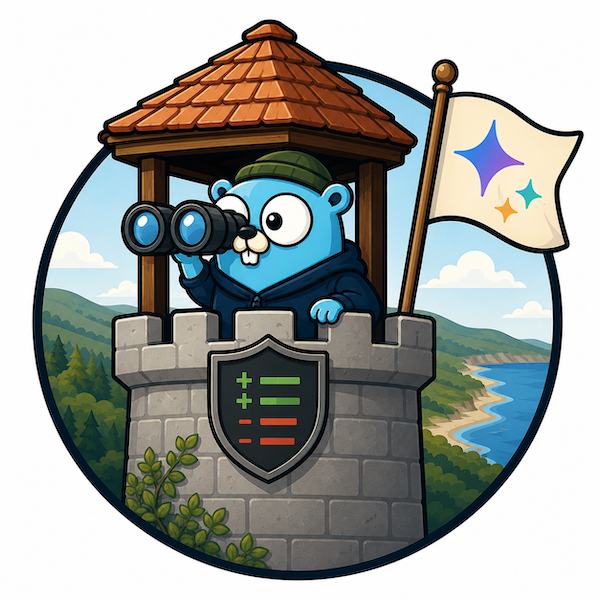

# Atalaia

<p align="center"></p>

<p align="center">
  <a href="https://github.com/juanfont/atalaia/actions/workflows/ci.yml"></a>
  <a href="https://github.com/juanfont/atalaia/blob/main/LICENSE"></a>
</p>

Secret detection for git commits, with a local LLM cutting the false positives.

Atalaia is a stateless HTTP service. Clients POST a unified diff. Atalaia runs `gitleaks` and `trufflehog`, hands the findings to a local OpenAI-compatible LLM (default: [vLLM](https://docs.vllm.ai) serving Gemma 4 E4B), and returns one verdict per finding, `confirmed` or `dismissed`. Detectors give you recall. The LLM gives you precision good enough that confirmed findings can drive direct developer notifications without a human triage step.

Two ways to run it:

- **CI / CD or pre-commit.** Drop a curl into your pipeline or hook to gate merges and commits before secrets land.
- **Source-host instance-wide.** One Atalaia behind a GitLab / GitHub / Bitbucket webhook scans every push across every project, no per-repo config, no developer-side setup.

Everything runs on your own infrastructure. No outbound calls in the default posture.

> _atalaia_, from Andalusi Arabic _ṭalāyiʿ_ through Galician-Portuguese, the watchtower posted ahead of the army to see what is coming.

## Why

Open-source secret scanners are precision-bound. A typical repo run produces enough false positives that real findings get lost. Verifying every hit against a provider API helps for some credentials but not most. A small language model reading each finding in context sorts the two piles cheaply.

Atalaia is the regex-then-LLM pattern packaged as a self-hostable service. The LLM does not detect, it decides.

## Architecture

```
                ┌───────────────────────────────────────────────┐
                │ atalaia (single Go binary)                    │
                │                                               │
  POST /check   │   parse diff                                  │
  ───────────►  │      │                                        │
  diff bytes    │      ▼                                        │
                │   run detectors in parallel                   │
                │      ├─ gitleaks (library, in-process)        │
                │      ├─ trufflehog (subprocess, AGPL fence)   │
                │      └─ kingfisher (subprocess, optional)     │
                │      │                                        │
                │      ▼                                        │
                │   canonical findings, deduplicated            │
                │      │                                        │
                │      ▼                                        │
                │   short-circuits (verified secrets,           │
                │   known sentinels)                            │
                │      │                                        │
                │      ▼                                        │
                │   LLM call ────────────────────►  vLLM        │
                │   schema-constrained, one call    (sibling    │
                │   covering all findings           process)    │
                │      │                                        │
                │      ▼                                        │
                │   verdicts + detection trail + stats          │
                └───────────────────────────────────────────────┘
```

One Go binary. The LLM is a sibling process (vLLM, llama.cpp, Ollama, anything OpenAI-compatible). Same host or private network.

## Quickstart

```sh
make build               # produces ./atalaia
make install-detectors   # pins and installs trufflehog and kingfisher
```

Start an OpenAI-compatible model server. vLLM on a 10 GB-VRAM GPU:

```sh
vllm serve google/gemma-4-E4B-it \
    --quantization fp8 --kv-cache-dtype fp8 \
    --max-model-len 131072 --max-num-seqs 1 \
    --host 127.0.0.1 --port 8000
```

Copy the example config:

```sh
cp config.example.yaml /etc/atalaia/atalaia.yaml
```

Verify and run:

```sh
./atalaia validate -c /etc/atalaia/atalaia.yaml
./atalaia probe    -c /etc/atalaia/atalaia.yaml
./atalaia serve    -c /etc/atalaia/atalaia.yaml
```

`POST /check` accepts `text/x-diff` or `application/json` with `{"diff": "..."}` and returns a list of verdicts plus per-request stats. `GET /healthz` is liveness (200 if the process is up). `GET /readyz` is readiness (200/503 based on LLM reachability). `GET /version` reports atalaia, detector, and LLM-model versions.

Two more `make` targets are available against a config that points at a real LLM:

- `make smoke CONFIG=path/to/atalaia.yaml`: end-to-end pipeline check, single fixture diff, assert response shape.
- `make smoke-corpus CONFIG=...`: full integration corpus (`internal/integration/testdata/diffs/`) with six fixtures covering real-credential and false-positive cases, graded on aggregate agreement (default floor 0.5, `INTEGRATION_MIN_AGREEMENT` to tune).

## Container

Tagged releases publish a multi-arch image to GHCR. `atalaia` plus pinned `trufflehog` and `kingfisher`, around 110 MB, non-root:

```sh
docker pull ghcr.io/juanfont/atalaia:latest
```

Defaults work out of the box. Point at an LLM and go:

```sh
docker run --rm -p 8080:8080 \
  -e ATALAIA_LLM_ENDPOINT=http://vllm:8000/v1 \
  -e ATALAIA_LLM_MODEL=google/gemma-4-E2B-it \
  ghcr.io/juanfont/atalaia:latest
```

For custom rulesets, bind-mount config files into `/etc/atalaia/` and point `atalaia.yaml` at the in-container paths:

```sh
docker run --rm -p 8080:8080 \
  -v $PWD/atalaia.yaml:/etc/atalaia/atalaia.yaml:ro \
  -v $PWD/gitleaks.toml:/etc/atalaia/gitleaks.toml:ro \
  -e ATALAIA_LLM_ENDPOINT=http://vllm:8000/v1 \
  ghcr.io/juanfont/atalaia:latest
```

Prompts live at `/etc/atalaia/prompts/` inside the image. Trufflehog is AGPL-3.0, see [LICENSE](LICENSE) and the upstream source at [trufflesecurity/trufflehog](https://github.com/trufflesecurity/trufflehog).

## Configuration

Every key in `atalaia.yaml` is overridable via env vars with the `ATALAIA_` prefix and dots replaced by underscores. `llm.endpoint` becomes `ATALAIA_LLM_ENDPOINT`. Search path: `./atalaia.yaml`, `$HOME/.atalaia/atalaia.yaml`, `/etc/atalaia/atalaia.yaml`. CLI `-c` overrides both.

See [config.example.yaml](config.example.yaml) for the full schema. Highlights:

- **Detectors.** Pick which to run (`detectors.enabled`), supply custom rule files (`detectors.gitleaks.config`, `detectors.trufflehog.config`, `detectors.kingfisher.rules`), include/exclude trufflehog detectors, pass arbitrary CLI flags via per-detector `extra_args`.
- **LLM.** Any OpenAI-compatible chat-completions endpoint. Tune the queue (`max_inflight`, `queue_max`), context budgets, and the prompt profile.
- **Tailscale.** Opt-in `tsnet` listener so Atalaia is reachable only from your tailnet. ACLs replace IP allowlists. `auth_key` must come from `ATALAIA_TAILSCALE_AUTH_KEY`, never the YAML.

## Network posture

Atalaia is plain HTTP. Two shapes:

**1. Loopback Atalaia behind a TLS-terminating reverse proxy.** Bind to `127.0.0.1:8080`, run caddy/nginx/envoy on `:443` with a cert, forward `/check` to the local port. Auth and rate-limiting live at the proxy. Bearer tokens via `ATALAIA_SERVER_AUTH_TOKEN` are defence in depth.

Minimal Caddyfile:

```
atalaia.example.com {
    reverse_proxy 127.0.0.1:8080
}
```

**2. Tailscale-only via the built-in `tsnet` listener.** Set `tailscale.enabled: true` and `tailscale.listen_only: true`. Auth key via `ATALAIA_TAILSCALE_AUTH_KEY`. The host port stays unbound. Only tailnet peers allowed by ACL can reach `/check`. The tailnet is already encrypted, no TLS terminator needed.

Either way, optionally gate `/check` with a bearer token (`server.auth_token`). `/healthz`, `/readyz`, `/version` stay open so orchestrator probes work without secrets. `/metrics` is on its own listener (`observability.metrics_addr`) so the main port can be locked down without losing scrape access.

## Integration

Atalaia is source-agnostic. Anything that produces a unified diff can call `/check`. Common patterns: GitLab/GitHub push-event watchers, pre-commit hooks, CI gates. See [docs/deployment.md](docs/deployment.md) for end-to-end deployment shapes and a worked GitLab integration.

Atalaia returns verdicts. The caller decides whether to block, notify, or log. It never stores diffs, findings, or verdicts.

## Security and threat model

- **In-memory only.** Atalaia never persists the diff, findings, or verdicts. Logs carry redacted previews, never raw matches.
- **No outbound calls in the default config.** Trufflehog runs with `--no-verification`. The only egress is Atalaia to its configured LLM endpoint.
- **License fence.** Trufflehog is AGPL-3.0. Atalaia invokes it as a subprocess and never imports it as a Go module. Atalaia ships under Apache 2.0.
- **The LLM endpoint must be trusted.** Prompts contain raw matches because the model needs to see the value to judge it. Run vLLM on the same network as Atalaia, or point at a third-party provider only when policy allows.

## License

Apache 2.0. See [LICENSE](LICENSE).

## Disclosure

Most of this was written with AI tooling under close human supervision. Every line reviewed, run, tested. The bootstrap (config loader, viper plumbing, log/init scaffolding) was also blatantly stolen from [Headscale](https://github.com/juanfont/headscale) :)

---
